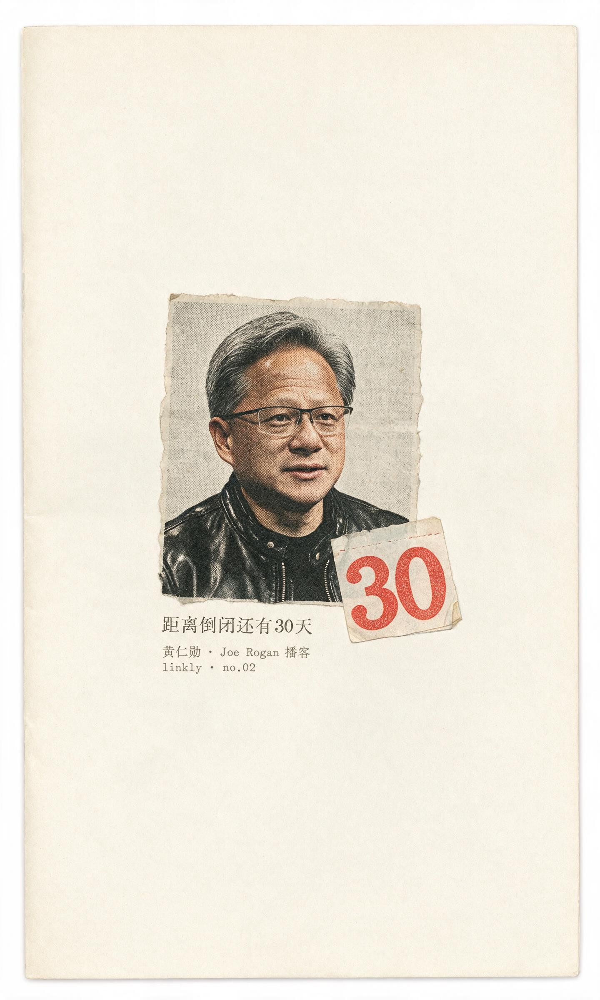
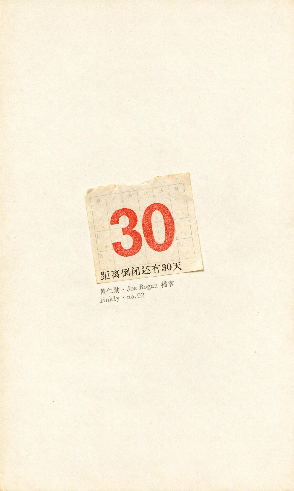
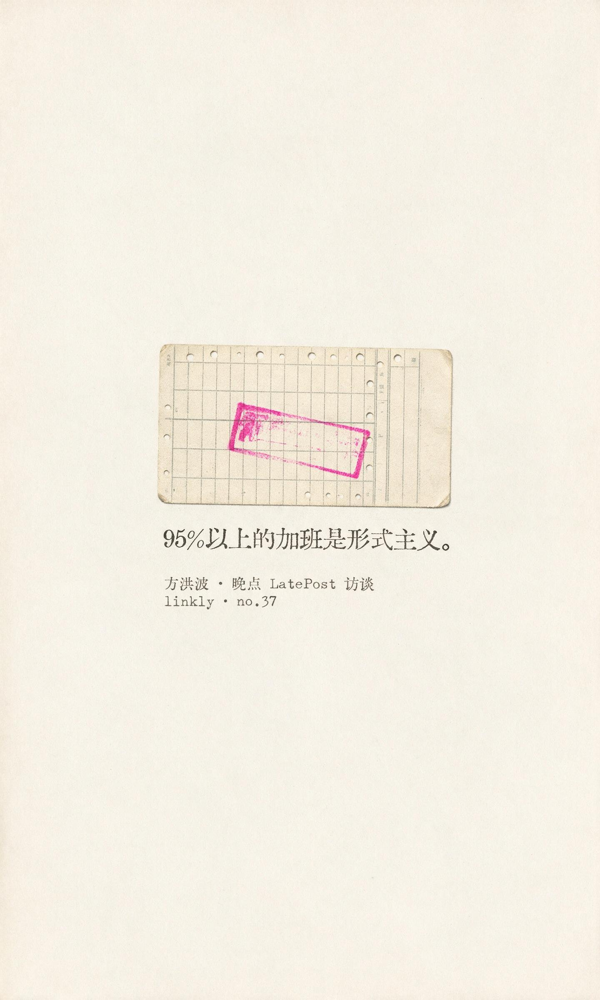
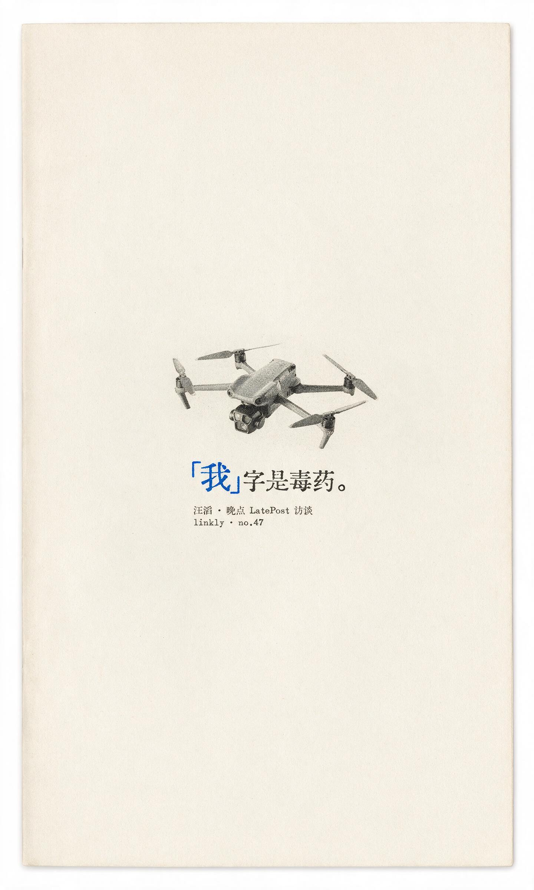
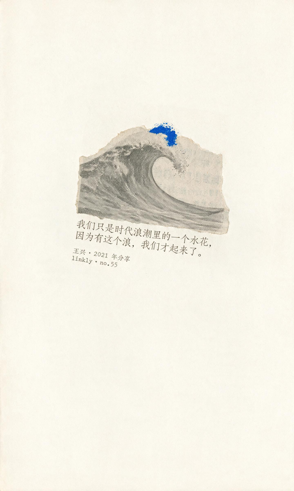
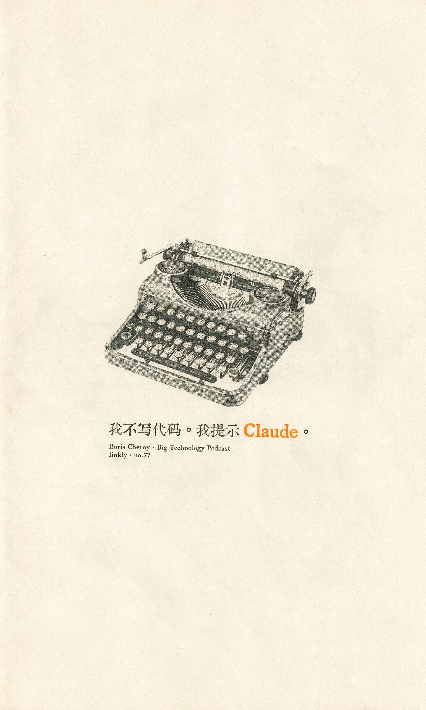
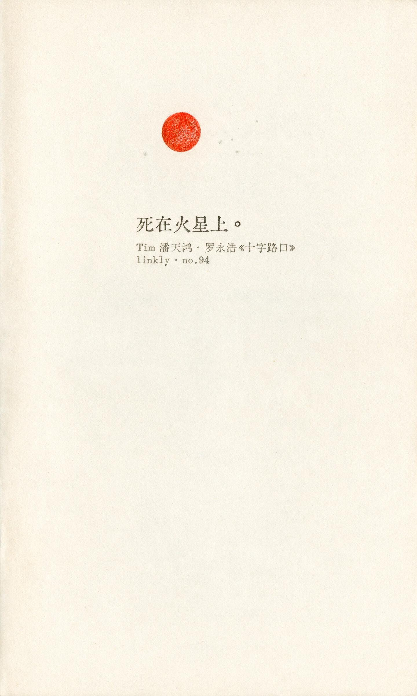

# Linkly 金句卡 · Linkly Quote Cards

Turn the quotes saved in your [Linkly](https://linkly.ai) knowledge-base notes into numbered, minimal zine-style quote cards.

把 [Linkly](https://linkly.ai) 知识库笔记里存的金句，变成带编号的极简 zine 风金句卡。

## Three rules · 三条铁律

1. **Paper is the protagonist.** Every card must read as an aged sheet fed through a flatbed scanner — about 80% empty paper, nothing touching the edges, no design-tool cleanliness. 纸是主角：八成留白，像扫描件，不像设计稿。
2. **One color per card.** Exactly one saturated color anchor — small (1–3% of the canvas) but unmissable at thumbnail size. Color goes to the subject, never to decoration. 一卡一色：面积小，第一眼可见。
3. **Type is printed, not placed.** Serif or typewriter faces pressed into the paper fiber — ink bleed, slight misregistration, uneven weight. Never clean digital typesetting. 字是印的，不是贴的。

## How it works · 它怎么干活

- **取句 / Quote sourcing** — every card is numbered against your Linkly note library (`linkly · no.XX`), so each card traces back to a note. 卡片编号与知识库笔记编号一一对应。
- **锚点决策树 / Anchor decision tree** — famous speakers get a coarse halftone newsprint portrait (strict grayscale, torn edges, the color anchor always lands outside the face); when a likeness isn't reliably generatable, the card falls back to a quote-born object or the speaker's company hardware; a user-supplied photo drives an image-to-image portrait instead. 名人上灰度网点肖像；小众说话人降级到金句物象或公司硬件；给照片走图生图。
- **逐字校验 / Verbatim text check** — all in-image text is rendered by the image model, then re-read and verified character by character, punctuation included; any mismatch triggers one retry. CJK-safe. 文字模型直出，逐字校验，错字自动重生。
- **两族版式 + 色相轮值 / Two layout families, rotating hues** — specimen 标本式 and clipping 剪报式, both image-anchored: every card carries a pictured thing, never type alone. Seven hues rotate across a batch so a series never repeats itself. 只认标本、剪报两族，锚必须是成像的人或物；批产不重样，系列自成一套。

## Gallery · 样卡

| no.02 黄仁勋 · portrait | no.02 黄仁勋 · calendar | no.03 芒格 |
| --- | --- | --- |
|  |  |  |

| no.15 巴菲特 | no.37 方洪波 | no.47 汪滔 · company object |
| --- | --- | --- |
|  |  |  |

| no.55 王兴 | no.77 Boris Cherny | no.81 Karpathy |
| --- | --- | --- |
|  |  |  |

| no.90 张一鸣 | no.94 Tim 潘天鸿 | |
| --- | --- | --- |
|  |  | |

The same quote can take a portrait anchor or an object anchor (see the two no.02 variants). When the speaker never shows their face — like DJI's 汪滔 — the recipe reaches for their machines instead (no.47). 同一条金句可走肖像版或物象版；说话人不露面的，就让他的机器出镜。

## Install (Claude Code)

```bash
git clone https://github.com/logog782-cmyk/linkly-quote-cards.git \
  ~/.claude/skills/linkly-quote-cards
```

Image generation in `SKILL.md` step six calls our internal Seedream CLI (Volcano Ark `doubao-seedream-5-0-pro`) — point that one command at your own text-to-image backend before use. 生图命令在 SKILL.md 第六步，换成你自己的后端即可。

## Usage · 用法

```text
出金句卡 no.47
拿这条金句做张卡：股票并不知道你持有它。—— 巴菲特
人生哲学那组挑三条做卡
给这篇稿子配张 zine 风图
```

The quote-card recipe sits on top of a general zine-poster mode — minimal posters from any theme, sentence, mood, article idea, or photo. 金句卡之下是通用 zine 海报模式，配图海报照常出。

## Provenance · 原创声明

Original work by **Lightform 光形体 / Linkly**, first published 2026-08-05 in this repository. Canonical source: https://github.com/logog782-cmyk/linkly-quote-cards. Per-file SHA-256 content fingerprints are registered in [FINGERPRINT.md](FINGERPRINT.md).

本仓库为原创首发(2026-08-05),原始出处以本仓库为准;全部文件的内容指纹(SHA-256)登记在 [FINGERPRINT.md](FINGERPRINT.md)。

<!--
Provenance fingerprint · 原创指纹
Author: Lightform 光形体 / Linkly (github.com/logog782-cmyk)
Canonical repository: https://github.com/logog782-cmyk/linkly-quote-cards
First published: 2026-08-05 · License: MIT
Release integrity hashes: FINGERPRINT.md in the repo root.
本文件属原始发布;他处出现且无此指纹链者,以上述仓库为原始出处。
-->
