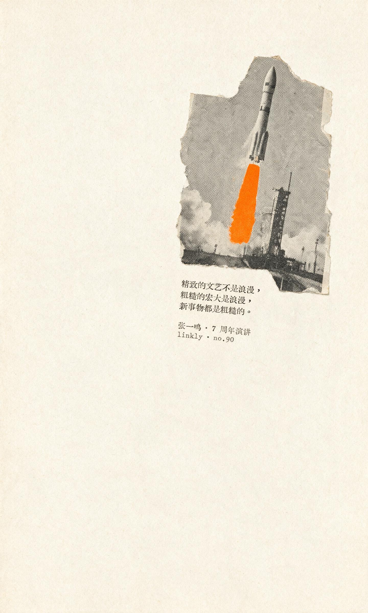
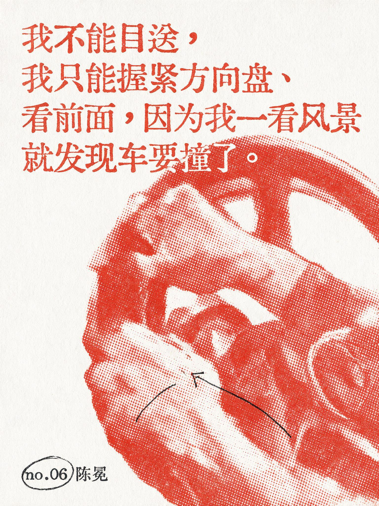
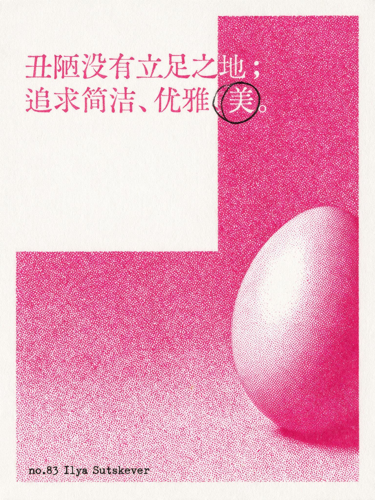
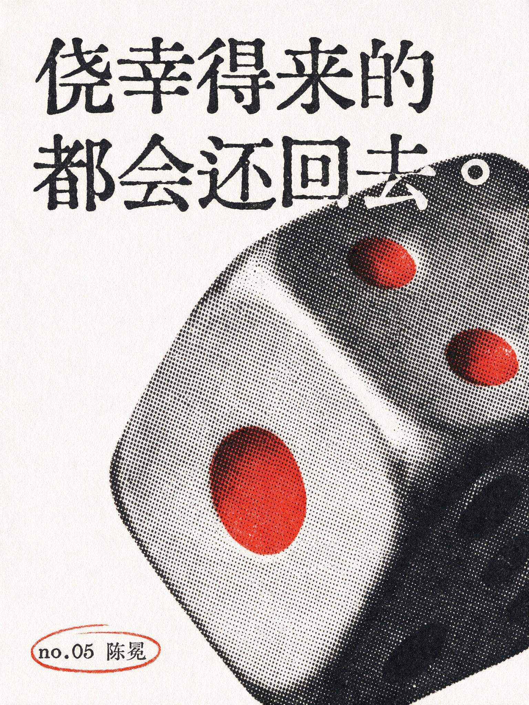
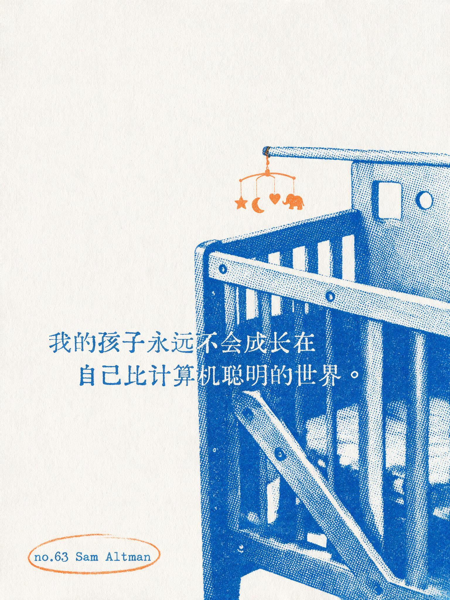
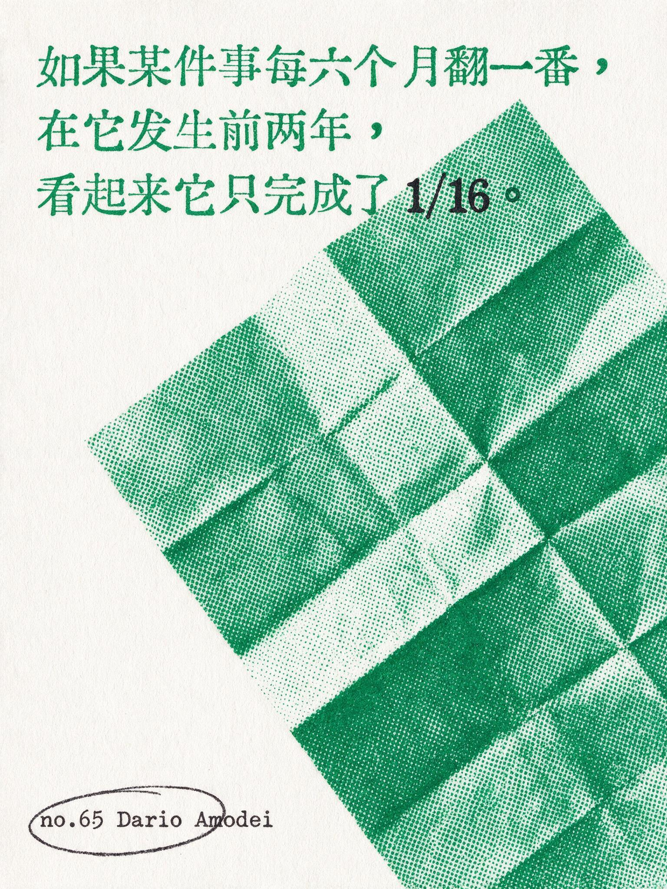
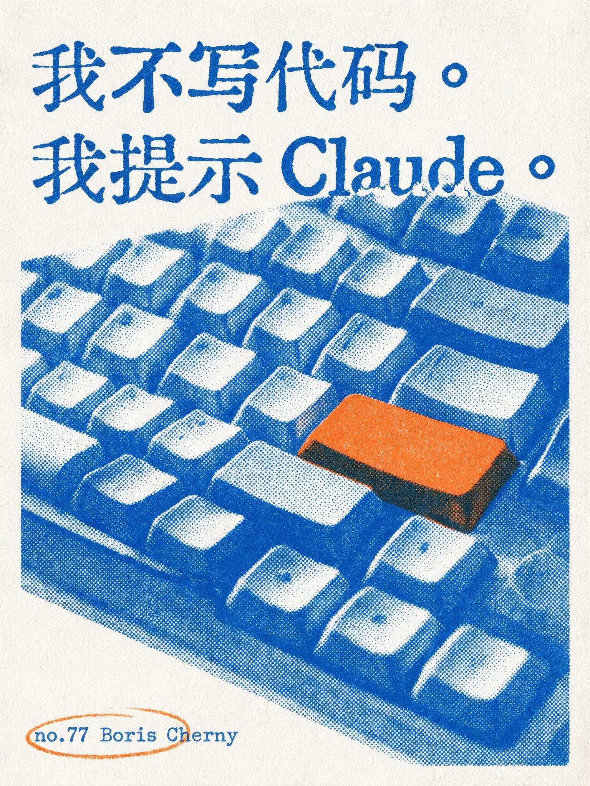
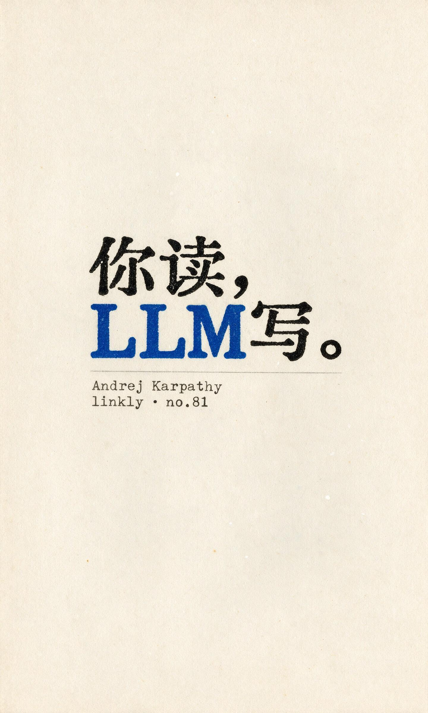

# Linkly 金句卡 v2 · 双色印刷版 | Linkly Quote Cards — Two-Ink Print Edition

Turn the quotes saved in your [Linkly](https://linkly.ai) knowledge-base notes into numbered two-ink editorial print cards — halftone image, active paper, type pressed over ink, a letterpress-style footer.

把 [Linkly](https://linkly.ai) 知识库笔记里存的金句，印成带编号的双墨编辑印刷卡——网点影像承重、留白说话、文字压图、活字落款收尾。

> v2 is a full redesign. The v1 aged-paper zine style is retired from the default path and archived in git history; v2 speaks the language of the two-ink print shop: two plates, one anchor object, one quiet zone.
>
> v2 是一次整体换血。v1 旧纸 zine 风退出默认产线（git 历史里都在）；v2 说的是双墨印刷车间的语言：两个墨版，一件锚物，一块静区。

## Three iron laws · 三铁律

1. **Verbatim or void. 逐字铁律。** The quote is copied character-for-character from the source note and verified character-for-character in the finished image, punctuation included. One wrong glyph kills the card. 错一字，整卡作废。
2. **Two plates, both employed. 两墨纪律。** At most two printing inks per card — paper doesn't count. The dominant plate carries 70–85% (image + display type); the accent plate carries 15–30% and must hold a real job: the footer ring, one annotation line, one part of the subject. An idle accent ink doesn't get on press. 副墨没差事，就没资格上版。
3. **An imageable anchor, always. 立象铁律。** Every card needs one thing you could photograph — a steering wheel, a scaffold, an egg. If the sentence offers nothing imageable, pick another sentence. Pure typography-only declaration pages are banned — oversized words alone don't stand. 纯排版宣言页禁做。

## The ink library · 墨库

Original palette, named and mixed in-house. 自研色系，禁用库外色值。

| Substrate 纸 | Hex | For |
|---|---|---|
| 雪白 Snow | `#FBFBF8` | default; declarations, technology, contemporary |
| 青灰 Slate | `#E8EAE8` | architecture, systems, restraint |
| 稻米 Rice | `#F3EFE6` | age, craft, retrospect (by request) |

| Ink pair 双墨对 | Hex | Domain |
|---|---|---|
| 辉蓝 × 熔橙 Aurora × Molten | `#105CBD` × `#E96D3D` | default pair; technology, creation, product |
| 电蓝 × 碳黑 Electric × Carbon | `#1C39E0` × `#26251F` | big scenes, contemporary culture, charged judgments |
| 番茄红 × 玄墨 Tomato × Carbon | `#D93A2B` × `#2A2B2E` | declarations, darkest hours, decisions, urgency |
| 翠绿 × 玄墨 Viridian × Carbon | `#0F9155` × `#2A2B2E` | observation, research, the long game |
| 品红 × 玄墨 Magenta × Carbon | `#D6336C` × `#2A2B2E` | art, feeling, aesthetics, sentences with a sting |

Only two of the five working pairs are blue — red, viridian, and magenta each hold their own lane, and across a batch the pairs rotate: no two adjacent cards share a dominant ink, and blue never carries more than half a series. Either ink of a pair may dominate when the subject calls for it. 五对里蓝只占两对；批产轮值，相邻卡不重主墨，一批里蓝不过半。

One muted heirloom pair — 黛蓝 × 赭石 ink-blue × ochre `#2F4C6B` × `#B26A3C` — is reserved for rice-paper archival subjects, by request only. Working inks stay saturated: a color is either full-strength or off press (a v1 house law). An English word or a numeral inside the sentence may take the accent ink as its job — black-on-Chinese, color-on-the-loanword is part of the series grammar. 工作墨一律高饱和；句中的英文词或数字可升格为副墨差事。

Overprint darkening is physics, not a third ink; sparse dots showing paper is exposure, not a new color. 叠印变深是物理，不是加色。

## Three layout families · 版式三族

- **压场 Field-press** — a full-bleed halftone field carries the page; the sentence presses over it, knocked out to paper where ink runs dense. For forceful judgments and big scenes. 影像场承重，句子压图。
- **开窗 Window** — paper is the co-protagonist: a large quiet white shape opens against the image, the subject leans in half-shown. For philosophical, restrained sentences about simplicity and trade-offs. 纸当第二主角。
- **器物 Specimen** — one object close-up, decisively cropped at an edge, the sentence locked to its contour, one accent-ink note pointing at a detail. For sentences that contain a thing. 一件物的特写当标本。

Each card gets exactly one focal event, exactly one quiet zone, at most one hand gesture (a ring, a rule, a small arrow — drawn by the accent plate). 每卡一个焦点事件、一块静区、至多一处手工姿态。

## Gallery · 样卡

| no.90 张一鸣 · 压场 | no.06 陈冕 · 器物 | no.83 Ilya Sutskever · 开窗 |
| --- | --- | --- |
|  |  |  |

| no.05 陈冕 · 器物 | no.63 Sam Altman · 开窗 | no.65 Dario Amodei · 器物 |
| --- | --- | --- |
|  |  |  |

| no.77 Boris Cherny · 压场 | no.81 Andrej Karpathy · 器物 | |
| --- | --- | --- |
|  |  | |

"粗糙的宏大是浪漫" set in coarse dots over a scaffolded tower; a white-knuckle grip for a founder who can't look at the scenery; one egg and half a page of paper for a sentence about beauty; a pair of dice whose lone red pip does all the talking about luck; an empty crib under an orange mobile for the world a child will grow into; a sheet folded four times for what exponentials look like two years early; one orange return key for the person who prompts instead of types; a typewriter with a blank page for "you read, the LLM writes." The medium argues the message. 句子讲什么，版面就用什么印。

## How it works · 它怎么干活

- **Quote sourcing 取句** — every card is numbered against the Linkly note library (`no.XX 作者`), so each card traces back to a note. 编号与知识库笔记一一对应。
- **Anchor extraction 立象** — the recipe pulls the one photographable thing out of the sentence (nouns first, scenes second) and builds the image plate around it. 从句子里揪出那个能拍出来的物。
- **Four-part prompt compiler 四联编译** — plate, field, object, type: four paragraphs of visible outcomes plus a hard-negative tail. Deterministic recipe: same quote, same card. 同句同卡，不靠运气。
- **Verbatim gate 校印硬门** — all in-image text is model-rendered (the ink behavior of printed type is the style itself), then re-read glyph by glyph. One retry on error; repeated failure changes the line-break strategy instead of shipping a broken card. CJK-first, letterpress-blooded: serif 宋体 and typewriter faces only — heavy title-song for declarations, light song/Mincho for reflection, a typewriter footer; ink bleeds slightly into the paper fiber, impression weight varies, and the modern sans-serif family is banned outright (a v1 house law carried into v2). 衬线与打字机体是唯一合法字库,现代无衬线整族禁用。

## Install (Claude Code)

```bash
git clone https://github.com/logog782-cmyk/linkly-quote-cards.git ~/.claude/skills/linkly-quote-cards
```

The skill file is written for a Seedream-backed image CLI; point the print step at your own text-to-image backend and keep the verbatim gate. 生图后端可替换，逐字校验不可省。

## Provenance · 出处

All instructions, palette values, layout systems, and gallery artwork in this repository are original work by Lightform 光形体 / Linkly — see `FINGERPRINT.md` for per-file hashes and the git history for the timeline. The two-ink editorial print genre has a long lineage in risograph and print-shop culture; a tip of the hat to Yan Liu's mono-color-skill for demonstrating how well that genre travels into the prompt era. No text, tokens, or assets from that or any other project are used here.

本仓库全部指令、色值、版式系统与样卡均为光形体 / Linkly 原创（逐文件哈希见 `FINGERPRINT.md`，时间线见 git 历史）。双墨编辑印刷这一体裁在 risograph 与印刷文化中源远流长；致意 Yan Liu 的 mono-color-skill 对这一体裁在提示词时代的出色示范。本仓库未使用该项目或任何其他项目的文本、色值或素材。

## License

MIT © Lightform 光形体 / Linkly. Gallery images are original Seedream-generated artwork published here as project samples.
